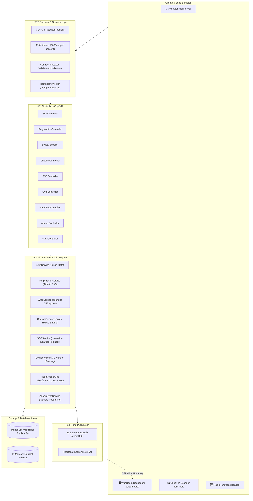
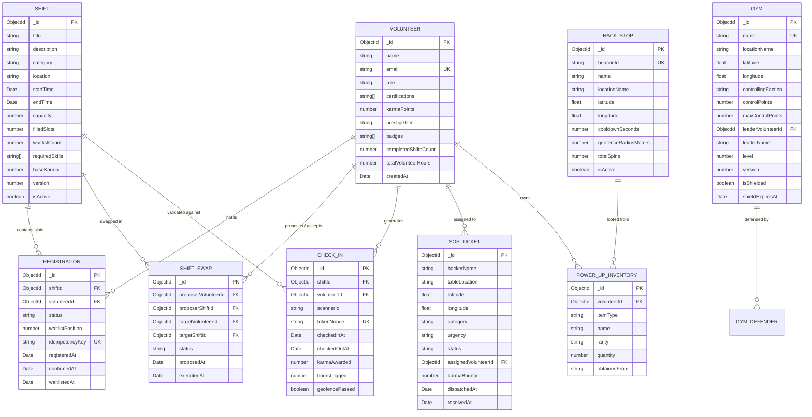
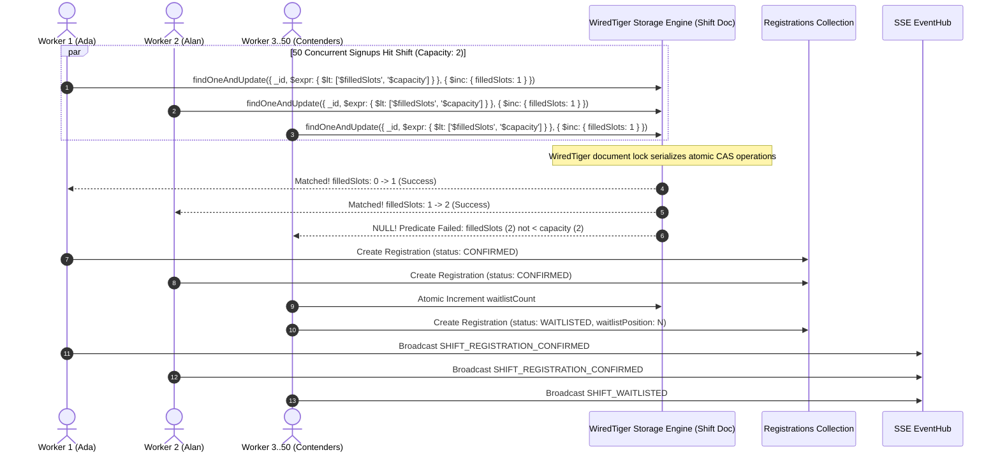
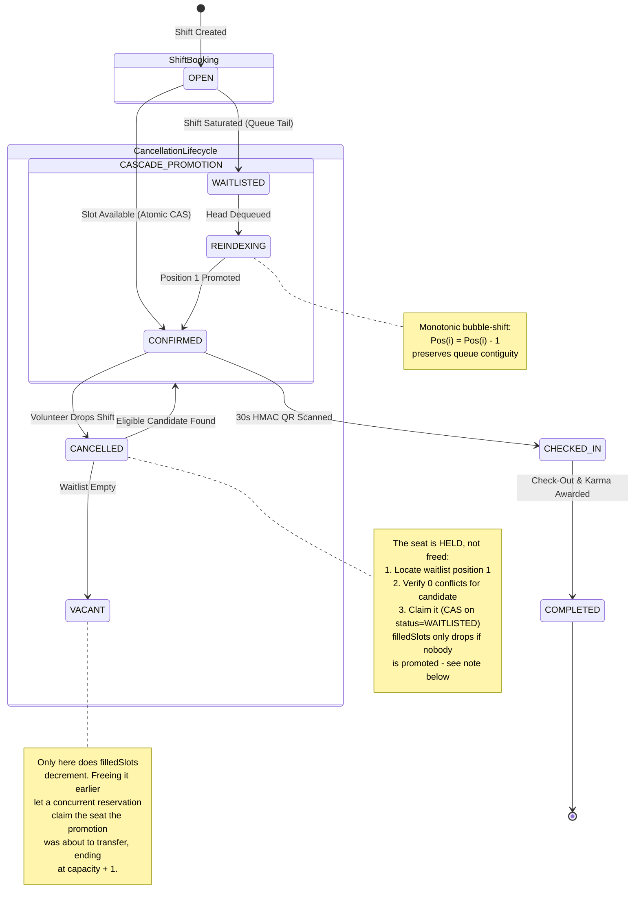
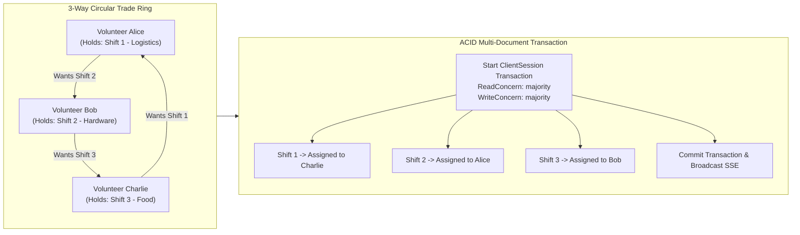
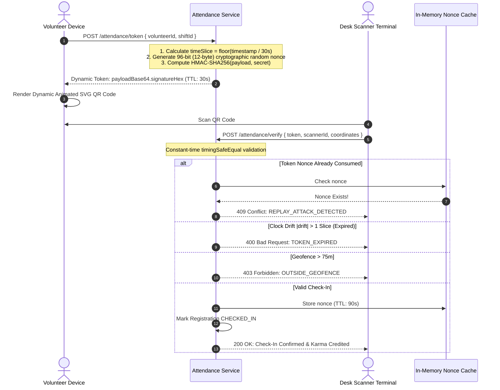
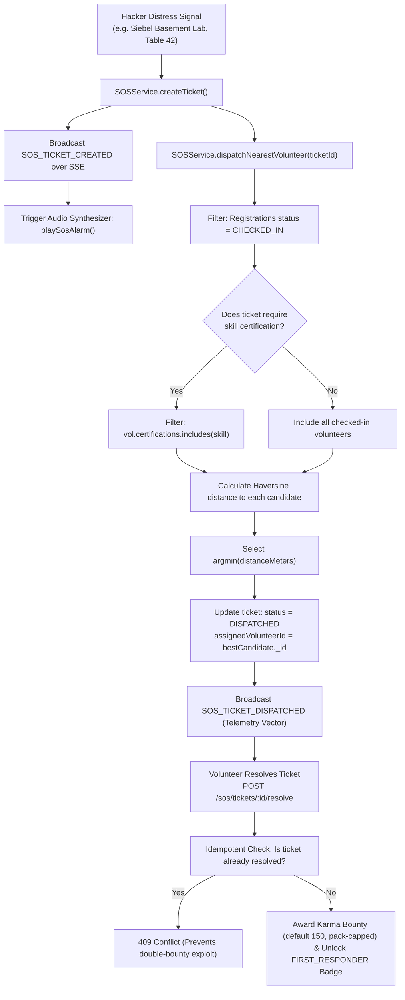
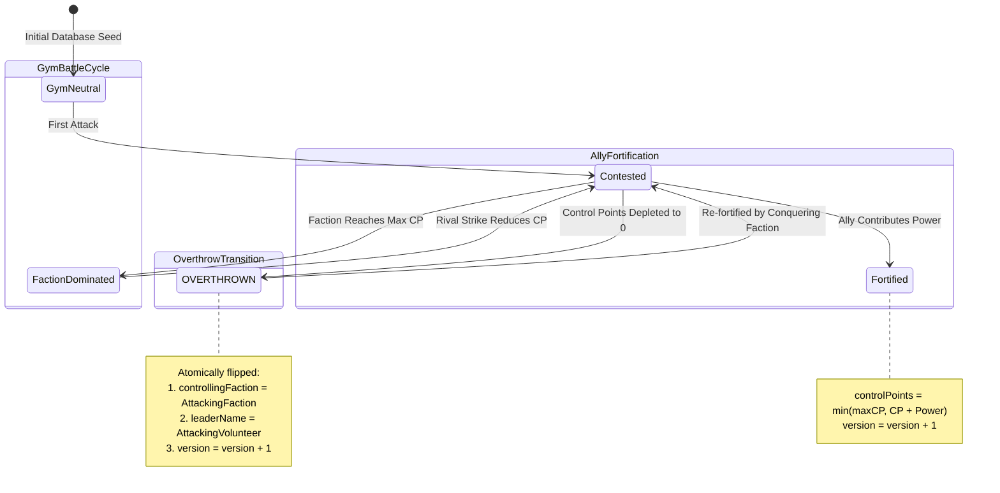
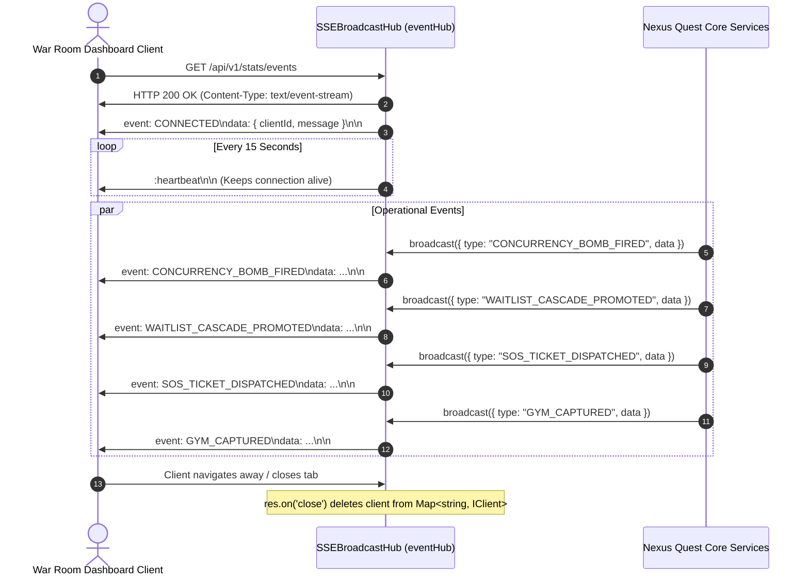

# 🌊 Nexus Quest — Comprehensive Systems Architecture & Engineering Specification
**Target Platform:** HackIllinois 2027 Systems Infrastructure  
**Adonix Alignment:** Strict compliance with [HackIllinois Adonix](https://github.com/HackIllinois/adonix) architectural standards  
**Language & Engine:** TypeScript 5.x / Node.js / MongoDB WiredTiger (Document-Level CAS & ACID Transactions)

> **Scope note.** Sections 3–6 (concurrency, waitlist, scheduling, swaps) describe the
> current code. Sections 1, 2 and 10–15 were written before content packs, plugins, the
> identity layer, WebSocket presence and the tiled campus renderer existed, and they do not
> cover any of them — see `docs/WORKFLOWS.md`, `docs/IDENTITY.md`, `docs/PRESENCE.md`,
> `docs/PLUGINS.md` and `docs/CONTENT-PACKS.md`, which are maintained against the code.
> Constants quoted here are checked against the source but the structure is not yet.

---

## 📑 Table of Contents
1. [Executive Summary & High-Level Topology](#1-executive-summary--high-level-topology)
2. [Database Schema & Entity-Relationship Architecture (ERD)](#2-database-schema--entity-relationship-architecture-erd)
3. [Concurrency Control: WiredTiger Atomic CAS vs TOCTOU Race Conditions](#3-concurrency-control-wiredtiger-atomic-cas-vs-toctou-race-conditions)
4. [Autonomous FIFO Waitlist Cascade State Machine](#4-autonomous-fifo-waitlist-cascade-state-machine)
5. [Scheduling Invariants: 30-Minute Rest Buffers & Fatigue Limits](#5-scheduling-invariants-30-minute-rest-buffers--fatigue-limits)
6. [Multi-Party Shift Swaps & the Directed Cyclic Trade Engine](#6-multi-party-shift-swaps--the-directed-cyclic-trade-engine)
7. [Dynamic Rotating HMAC-SHA256 QR Attendance Protocol](#7-dynamic-rotating-hmac-sha256-qr-attendance-protocol)
8. [Geodesic Spatial Geofencing & Haversine Distance Engine](#8-geodesic-spatial-geofencing--haversine-distance-engine)
9. [Hacker SOS Emergency Distress & Spatial Dispatch Engine](#9-hacker-sos-emergency-distress--spatial-dispatch-engine)
10. [PokéShift: UIUC Campus Turf Wars & OCC Versioning](#10-pokeshift-uiuc-campus-turf-wars--occ-versioning)
11. [HackStop Supply Beacons & CAS Power-Up Inventory](#11-hackstop-supply-beacons--cas-power-up-inventory)
12. [Reactive Event Mesh: Server-Sent Events (SSE) Hub](#12-reactive-event-mesh-server-sent-events-sse-hub)
13. [Security, Threat Modeling & Adversarial Hardening](#13-security-threat-modeling--adversarial-hardening)
14. [NEXUS OS War Room: The WebGL Campus Renderer](#14-nexus-os-war-room-the-webgl-campus-renderer)

---

## 1. Executive Summary & High-Level Topology

Nexus Quest is an event-driven volunteer shift scheduling and field operations platform engineered specifically for high-stress collegiate hackathons. During events with 1,000+ attendees across distributed university facilities (e.g. Siebel Center, ECEB, Kenney Gym), standard scheduling systems suffer from catastrophic failure modes: oversold high-demand shifts, cascade dropouts, fatigue-induced safety violations, attendance fraud via static screenshots, and resource starvation during emergency incidents.

The following topology diagram illustrates the end-to-end request lifecycle through Nexus Quest:



---

## 2. Database Schema & Entity-Relationship Architecture (ERD)

> The diagram below covers the scheduling and game core. **[docs/DATA-MODEL.md](docs/DATA-MODEL.md)
> is the complete reference** — all twenty-three collections including the four economy ledgers,
> the two auth tables and the audit tables this ERD does not draw — and explains why each one is
> a separate collection rather than a field on something else.

The domain data model enforces strict data integrity, foreign key references, compound uniqueness constraints, and optimistic version tokens directly within MongoDB:



---

## 3. Concurrency Control: WiredTiger Atomic CAS vs TOCTOU Race Conditions

### 3.1 The TOCTOU (Time-of-Check to Time-of-Use) Failure Mode
In naive systems, slot registration is implemented as:
```text
1. Shift.findById(shiftId)
2. if (shift.filledSlots < shift.capacity) {
3.     shift.filledSlots += 1;
4.     await shift.save();
5. }
```
When $N=50$ concurrent requests hit step 1 at $t=0$, all 50 observe `filledSlots = 0 < capacity = 2`. All 50 proceed to line 4, overwriting the document and creating **48 oversold registrations**.

### 3.2 The atomic compare-and-swap solution
Nexus Quest eliminates application-level race conditions by pushing the saturation condition directly into MongoDB's WiredTiger storage engine:



$$\text{Atomicity Predicate: } \mathcal{P}(S) \equiv \big( S.\text{filledSlots} < S.\text{capacity} \big)$$

If $\mathcal{P}(S)$ evaluates to `false`, the operation yields a zero-write document return and immediately falls back to FIFO waitlist enqueueing.

---

## 4. Autonomous FIFO Waitlist Cascade State Machine

When a confirmed volunteer cancels their shift, standard systems leave the slot vacant until an organizer manually notices or a candidate re-applies. Nexus Quest operates an autonomous cascade engine:



---

## 5. Scheduling Invariants: 30-Minute Rest Buffers & Fatigue Limits

### 5.1 Rest Buffer Calculus
To prevent physical and cognitive exhaustion during 36-hour hackathons, the scheduler enforces a non-zero rest interval $\beta = 30\text{ minutes}$ ($1,800\text{ seconds}$) between shifts $A$ and $B$:

$$[S_A, E_A) \cap [S_B - \beta, E_B + \beta) = \emptyset$$

```text
Shift A: [===================]
Rest Window:                 |--- 30 Min Buffer ---|
Shift B (Valid):                                   [====================]
Shift B (Rejected 409):            [====================] (Violates Rest Buffer)
```

### 5.2 8-Hour Daily Fatigue Boundary
Let $\mathcal{S}_u(D)$ be the set of confirmed shifts for volunteer $u$ on calendar date $D$. The scheduler asserts:

$$\sum_{s \in \mathcal{S}_u(D)} \text{DurationHours}(s) \le 8.0\text{ hours}$$

Attempting to book a shift that pushes the cumulative daily duration past 8.0 hours fails with HTTP 409 `DAILY_FATIGUE_EXCEEDED`.

---

## 6. Multi-Party Shift Swaps & the Directed Cyclic Trade Engine

Direct 1-to-1 trades fail in >90% of hackathon logistics situations due to mismatched volunteer preferences. Nexus Quest constructs a directed preference graph $G = (V, E)$ where edge $(u, v) \in E$ denotes that Volunteer $u$ is willing to surrender their shift in exchange for the shift held by Volunteer $v$.



### Cycle discovery (`src/common/utils/cycleFinder.ts`)

Bounded elementary-cycle enumeration by depth-first search. Not Tarjan, and not an SCC
decomposition — this document claimed both for a while, and the code has never contained
either. The rings being looked for are two to four people long in a graph of at most a few
hundred pending proposals, so the asymptotic win from condensing components first buys
nothing and the direct search is the whole algorithm.

1. Build the adjacency list $G$ from `PENDING` proposals: an edge $u \rightarrow v$ exists
   when $u$ wants the shift $v$ currently holds.
2. From each node in sorted order, walk depth-first with the start node held fixed, bounded
   at $k \in [2, 4]$ and guarded by an on-stack set so a node is never re-entered within a
   walk.
3. Deduplicate by construction rather than by hashing afterwards: an edge to a node
   lexicographically smaller than the start node is not traversed, so each cycle is
   discovered exactly once, from its smallest member. There is no canonical-rotation hash.
4. Execute the rotation inside one MongoDB `ClientSession` transaction — every leg moves or
   none does — after validating each leg's certifications and schedule conflicts up front.

---

## 7. Dynamic Rotating HMAC-SHA256 QR Attendance Protocol

To eliminate attendance fraud (e.g. sharing static screenshots on Discord), Nexus Quest generates cryptographic time-windowed tokens that rotate every 30 seconds:



---

## 8. Geodesic Spatial Geofencing & Haversine Distance Engine

Physical presence verification is calculated using the spherical Earth Haversine formula ($R = 6,371,000\text{m}$):

$$\Delta\phi = \phi_2 - \phi_1, \quad \Delta\lambda = \lambda_2 - \lambda_1$$

$$a = \sin^2\left(\frac{\Delta\phi}{2}\right) + \cos(\phi_1)\cos(\phi_2)\sin^2\left(\frac{\Delta\lambda}{2}\right)$$

$$a_{\text{clamped}} = \min\big(1.0, \max(0.0, a)\big)$$

$$c = 2 \cdot \text{atan2}\left(\sqrt{a_{\text{clamped}}}, \sqrt{1 - a_{\text{clamped}}}\right), \quad d = R \cdot c$$

```
                                [KENNEY GYM]
                               (40.113054, -88.228012)
                                       ▲
                                       │  Distance: 278m
                                       │  Geofence: 75m
                                       │  [REJECTED 403]
                                       │
[ECEB LOBBY] <----------------- [SIEBEL ATRIUM] -----------------> [DCL BRIDGE]
(40.114828, -88.228056)       (40.113812, -88.224937)       (40.113215, -88.226500)
    Distance: 284m               [HQ / SCANNER]                 Distance: 153m
    [REJECTED 403]               Volunteer (<5m)                [REJECTED 403]
                                 [APPROVED 200]
```

---

## 9. Hacker SOS Emergency Distress & Spatial Dispatch Engine



---

## 10. PokéShift: UIUC Campus Turf Wars & OCC Versioning

To gamify hackathon volunteer operations, UIUC campus hubs represent contested battlegrounds under three competing factions:
* **Team Kernel (`TEAM_KERNEL`):** Systems & Infrastructure Division (Siebel Center HQ, Electric Cyan `#22d3ee`)
* **Team Tensor (`TEAM_TENSOR`):** Artificial Intelligence & Machine Learning Division (ECEB Labs, Soft Violet `#a78bfa`)
* **Team Silicon (`TEAM_SILICON`):** Hardware & Robotics Division (Kenney Gym, Electric Amber `#fbbf24`)

### Optimistic Concurrency Control (OCC) State Fencing:


Every battle executes with version checking:
```typescript
const updated = await Gym.findOneAndUpdate(
  { _id: gymId, version: currentVersion },
  { $set: newAttributes, $inc: { version: 1 } },
  { new: true }
);
```
If another volunteer contests the gym concurrently, `updated` returns `null`, and the algorithm retries with jittered exponential backoff (up to 5 attempts).

---

## 11. HackStop Supply Beacons & CAS Power-Up Inventory

Physical campus HackStops provide volunteers with supplies and randomized collectibles:


---

## 12. Reactive Event Mesh: Server-Sent Events (SSE) Hub

Nexus Quest employs a lightweight, uni-directional Server-Sent Events hub (`eventHub`) with connection pooling, channel multiplexing, and automated teardown:



---

## 13. Security, Threat Modeling & Adversarial Hardening

| Threat Vector | Potential Impact | Nexus Quest Mitigation Mechanism |
|---|---|---|
| **Race-Condition Overbooking** | 50 volunteers confirm for a 2-slot shift | WiredTiger atomic CAS predicate `$expr: { $lt: ['$filledSlots', '$capacity'] }`. |
| **Attendance Screenshot Sharing** | Unattended volunteer checks in remotely | Dynamic HMAC-SHA256 tokens rotating every 30s with single-use nonce cache. |
| **Proxy Attendance Spoofing** | Volunteer checks in from dorm outside venue | 75m geodesic Haversine distance geofence boundary verification. |
| **Double-Bounty SOS Exploitation** | Malicious caller spams ticket resolution | Atomic state precondition: `status === DISPATCHED` required for transition to `RESOLVED`. |
| **Gym Damage Inversion** | Negative power input heals enemy gym | Boundary validation: $P \in [10, 500]$ and integer-only sanitization. |
| **NoSQL Operator Injection** | Attacker injects `$ne` or `$regex` into query | Contract-first Zod schemas enforcing native TypeScript enums. |
| **BSON CastError Leaks** | Arbitrary strings crash server and leak topology | Strict 24-char hexadecimal regex matching on all ObjectID parameters. |
| **DDoS API Flooding** | Resource exhaustion on check-in endpoints | Layered limiters: 300/min per account, 600/min anonymous per IP, a 3,000/min per-IP ceiling, 90/min for mutations and 30/min for credential exchanges. |

---

## 14. NEXUS OS War Room: The WebGL Campus Renderer

The dashboard renders the live operation on a 3D model of the actual University
of Illinois Urbana-Champaign campus. Fourteen real landmarks are the contestable
territory gyms, so a captured stronghold is a recognisable building rather than
an abstract marker.

### 14.1 Why hand-written WebGL2

`src/app.ts` serves the dashboard under a Content-Security-Policy whose
`script-src` is `'self'` — no `'unsafe-inline'`. A CDN build of three.js is blocked
outright, and vendoring a full engine to draw ~900 boxes is disproportionate.
`public/gl/glx.js` is therefore a ~450-line WebGL2 layer — mat4/vec3, program
and VAO plumbing, half-float render targets, geometry generators, ear-clipping
triangulation and a static batcher — and `public/gl/campus3d.js` is the scene.

### 14.2 Data provenance

The city is not hand-authored. `design/build-campus.py` bakes two cached
OpenStreetMap extracts (ODbL 1.0, fetched via the Overpass API and cached
under `design/osm/`, which `.gitignore` excludes — the committed part is the
`.overpass` queries and `manifest.json` that let anyone refetch them byte-for-byte) into `content/<pack>/campus/` (tiled; the single-file
`public/gl/uiuc-campus.json` no longer exists):

```text
  design/osm/buildings.json   2.4 MB   2493 building ways
  design/osm/extra.json       4.1 MB   parks, stadiums, artwork nodes, highways
                    │
                    ▼  build-campus.py
      ┌─────────────────────────────────────────────┐
      │ • project WGS84 → local metric frame        │  origin = Main Quad
      │   (+x east, +z south, 10 m per world unit)  │  40.10746, -88.22713
      │ • Douglas-Peucker simplify at 1.1 m         │
      │ • height from OSM height= / building:levels │  419 buildings tagged
      │ • resolve 14 monuments by name, then by     │
      │   proximity (<55 m, no double-claiming)     │
      └─────────────────────────────────────────────┘
                    │
                    ▼
  content/<pack>/campus/       124 tiles + index.json
    9,188 building footprints · 1,994 roads · 467 lawns · 14 monuments · 124 tiles
```

Landmark coordinates in `HACKILLINOIS_VENUES` (`src/common/utils/geo.ts`) were
cross-checked against OSM building centroids while building the map. That audit
corrected several venue positions — Kenney Gym was ~450 m south of its true
location — so the geofencing engine and the map now agree on where campus is.

Two monuments are massed from their verified centroid rather than an outline:
Alma Mater is a `tourism=artwork` node, and neither ECEB nor the Main Library
carries a `building=*` way in the extract. Each is flagged `src: "synth"` in the
model so the distinction stays visible rather than being quietly implied.

### 14.3 Render pipeline

```text
   ┌── pass 1 ─────────────────────────────────────────────┐
   │  ground plane   procedural grid + range rings + sweep │
   │  streamed tiles 500 m each, baked in a worker         │  ← public/gl/tiles.js
   │  decal batch    streets + lawns, ONE draw call        │
   │  monuments      14 × footprint + landmark crown       │
   │  actors         volunteers / beacons / distress cones │
   │  additive       auras, geofence rings, shockwaves     │
   └───────────────────────┬───────────────────────────────┘
                           ▼  RGBA16F target
   ┌── pass 2: bloom ──────────────────────────────────────┐
   │  bright pass (soft-knee threshold 0.58) → half res    │
   │  3 × separable 9-tap Gaussian (H then V)              │
   └───────────────────────┬───────────────────────────────┘
                           ▼
   ┌── pass 3: composite ──────────────────────────────────┐
   │  scene + bloom · ACES tonemap · chromatic aberration  │
   │  scanlines · vignette · film grain                    │
   └───────────────────────────────────────────────────────┘
```

Two details carry most of the visual weight:

- **Static batching.** 9,188 buildings as 9,188 draw calls stutters on integrated
  GPUs. `mergeStatic()` bakes position, normal, per-vertex colour and emissive
  into one interleaved buffer, so the ambient city costs a single
  `drawElements`. Only the 14 monuments are dynamic, because only they change
  colour when a faction captures them.
- **Analytic LOD on the window lights** (and, since the fidelity pass, on every procedural material). Facades carry a procedural window grid
  keyed on a per-cell hash. Left unguarded it aliases into sparkling noise once
  a cell falls below a pixel, so the shader measures the cell's screen
  footprint with `fwidth()` and fades the pattern out — the reasoning a mip
  chain applies, done analytically because the pattern has no texture.

### 14.4 Live binding

| Domain event | Map response |
|---|---|
| `GYM_CAPTURED` / `GYM_ATTACKED` | monument recolours to the holding faction; shockwave ring |
| Filled shift slot | a crystal enters orbit around that shift's venue |
| `HACKSTOP_SPUN` | beacon pulses; its 75 m geofence ring is drawn to scale |
| `SOS_TICKET_CREATED` | distress cone at the ticket's real coordinates, alarm rings |
| Monument click | camera eases in; garrison, level and control points open in the rail |

Monument labels are HTML positioned from projected world coordinates each
frame, not canvas text — they stay crisp at any zoom and inherit page
typography.

---

### 14.5 Fidelity pass — reference-driven materials and surveyed detail

A second pass pushed the model from "a city of boxes" toward the actual campus.
Everything in it is traceable to a source in the repo.

**Surveyed detail (design/osm/detail.overpass → design/osm/detail.json).** A
third Overpass extract adds the layers OSM maps individually: **2,343
`natural=tree` nodes** (the elm rows on the Quad are real positions; generated
rows only fill gaps > 12 m from a surveyed tree), 63 street lamps (+ generated
fill to 360), 32 water features including Boneyard Creek, the Illinois Central
rail line, 243 parking pads, 12 fountains, and `roof:shape` where tagged. They
bake into three static batches — buildings + roof caps, ground decals, and
greenery — so the whole ambient campus is still three draw calls.

**Reference photographs (design/refs/).** Ten Wikimedia Commons photographs
of the monuments were fetched and read; `design/refs/MATERIALS.md` records the
albedo, trim and roof of each building as observed, and corrected the brief
in several places (Altgeld is grey rusticated limestone under a red terracotta
spire, not orange sandstone; Foellinger's dome is verdigris; the Union carries
a white cupola over slate). The official brand palette was verified against
brand.illinois.edu: Illini Orange `#FF5F05`, Illini Blue `#13294B`, and the
secondary set (Patina `#007E8E` is, conveniently, the verdigris).

**Procedural materials (public/gl/materials.js).** Twenty-two surfaces —
brick with mortar courses, grey and buff limestone, verdigris (flat and
ribbed for domes), slate, terracotta tile, glass curtain wall, ribbed concrete,
asphalt with centre line, walk, lawn, canopy, water, rail ballast, bronze,
granite — as pure GLSL functions of world position. No textures: the CSP
forbids them and the patterns are metric anyway (a brick is 0.2 × 0.065 m at
10 m per world unit). Every `fwidth()` is evaluated at the top of
`material()` outside any branch, and each pattern fades to its flat albedo once
a cell drops below ~1 px, so the campus reads as solid mass from altitude and
as coursed brick from the Quad.

```text
  static batch vertex:  pos · nrm · colour · emissive · [matId, nightTint] · [across, along]
                                                          ▲                    ▲
                        mergeStatic() assigns per piece ──┘   ribbonGeometry ──┘ (centre lines, rails)

  fragment:  s = material(vMat, world, N, t, extras)      one call, unconditional
             albedo = s.albedo × tint · N' = N + s.nrm · rim × (1 − rough)
             + window lights · + radar sweep · fog → HDR target → bloom → composite
```

Monuments take a `uMat` per draw, inferred from the material reference each
crown piece already used (`MAT.copper → verdigris`, `MAT.tile → terracotta`,
`MAT.trim → whiteTrim`, State Farm's concrete → ribbed with `uRibCenter` at the
building centre). A viewer-side floodlight term lets a monument read in its
own material at night instead of dissolving into blue ambient.

**Sky, fog, cinema.** A starfield pass with an Industrial→Illini-blue
gradient and orange skyglow replaces the flat clear colour; height fog is
gated to campus-wide zoom so it never muddies a close-up. The dashboard's
Campus Grid is now the full-width hero with a telemetry strip (fps, buildings,
monuments, camera distance) and a cinematic mode that hides the chrome
(Escape exits). Clicking a monument opens a dossier from
`content/<pack>/monuments-info.json` — year, architect, style and three facts per
landmark, sourced from Wikipedia and flagged `approximate` where no article
exists.

**What is still approximate.** ECEB and the Main Library have no building way
in OSM and are massed from verified centroids (`src: "synth"`). Alma Mater is
a low-poly figure group, not a sculpture. The stadium is a tiered ellipse with
end blocks rather than a true open horseshoe mesh. Only three OSM buildings
carry `roof:shape`.

---

### 14.6 Nexus Quest — the retro game layer

The dashboard's chrome was rebuilt as a pixel-art game UI after two polished
"ops console" passes were judged generic. Three directions were mocked in
OpenPencil (`design/directions/{gameboy,snes,neoretro}.mjs`, rendered to
`design/exports/<dir>/`); **Neo-retro indie** was chosen — Silkscreen, Jersey
10, Pixelify Sans and VT323, hard 4 px offset shadows, 4 px chamfer notches,
tab buttons that depress, sticker badges, a Boneyard-duck mascot — borrowing
the SNES direction's battle window and message box for gym encounters.

```text
  public/sprites.js     16x16 memorabilia + icons rasterised from content/<pack>/memorabilia.json
  public/avatar.js      webcam/photo → 32x32 (OKLab quantise, Bayer dither) → 128x48 walk sheet
  public/game.js        trainer profile, sticker book, encounter overlay, walk-to-spin gate,
                        geolocation "Walk with me", retro toggle, duck toasts
  public/gl/campus3d.js player billboard (NEAREST-filtered sheet), WASD + follow-cam,
                        setPlayerLatLng (same frame as build-campus.py), proximity events
                        with hysteresis, renderMinimap, setRetro (pixelate/posterize)
```

**The Pokémon-Go loop.** The player sprite walks the real campus — WASD, or
`navigator.geolocation.watchPosition` piped into `setPlayerLatLng` (opt-in by
click; resumed only when permission is already granted and the Campus tab is
open). Off campus the sprite parks at the model's edge and says so. Standing
within 75 m of a HackStop enables Spin; a gym row opens the encounter (FIGHT /
REINFORCE / BAG / MAP / RUN, Escape closes and returns focus). **Proof of
presence is real, not cosmetic:** spins and battles send the *player's*
position (`fromWorld(x, z)`), not the target's coordinates, so the server's
existing 75 m geofence does the check — the client gate is UX, the server is
the authority. Loot drops reveal as "YOU FOUND" with a memorabilia sprite of
the same rarity; holding a monument earns its badge on the trainer card.

**Content.** `content/<pack>/memorabilia.json` — 16 HackIllinois items with 16×16
palette-indexed pixel grids, rarity, how each is earned, and one gym badge per
monument (validated at load; a malformed item is skipped with a warning, never
thrown). `content/<pack>/monuments-info.json` feeds the collectible monument card.

**Cross-review.** Three rounds of independent read-only review (muse and agy
on the renderer, opencode on the app; codex and cursor-agent unavailable for
billing/login). Confirmed and fixed from the final round: keyboard steps
fighting GPS smoothing, a wrong sprite-aspect formula for 48 px avatars,
`fwidth(atan)` spiking at the ±π seam on ribbed domes, a stretched minimap,
retro DPR baked once, proximity keyed by id without kind, target-coordinate
spins (above), a geolocation prompt that could fire without a click, an
encounter with no keyboard exit, 7 px labels, and unvalidated content.

---

## 15. Verification & Operational Matrix

```text
========================================================================================
VERIFICATION MATRIX — 29 suites, 306 tests
========================================================================================
Run `npm test` for the authoritative figure; the numbers above are a snapshot, not a claim.

  masterEndToEnd   ten interconnected systems, one operational simulation
  concurrency      50-worker high-contention race against two seats
  registration     rest buffers, fatigue caps, skill certifications
  lifecycle        the registration state machine only moves forward
  checkin          rotating 30 s HMAC tokens and the anti-replay cache
  attendance       check-out pays exactly once, pro rata
  swaps            directed-graph multi-party cyclic trades
  waitlist         autonomous FIFO cascade promotion
  seededDemo       the shipped demo scenario itself
  geoSos           75 m geofencing, nearest-responder dispatch, Adonix sync
  ops              SOS lifecycle, announcements, roster redaction
  identity         three adapters, CSRF, revocation, claimed-vs-proved identity
  rateLimiter      the four limiters, keyed and stacked
  sse              channels, replay, backpressure, stream slots
  presence         fuzzing, opt-out symmetry, exact-read auditing
  scale            the shared interest computation at 5,000 sessions
  economy          the karma ledger, daily caps, bounty budgets
  game             quests, stickers, streaks over the domain bus
  pokestop         turf-war OCC battles and HackStop beacons
  shifts           catalogue encodings and circadian surge pricing
  content          pack validation and cross-references
  campus           the tiled bake, per-tile hashes, monument ids
  legacyCompat     the open-demo contract still holdsng
========================================================================================
```

