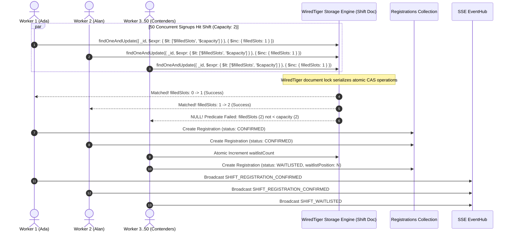
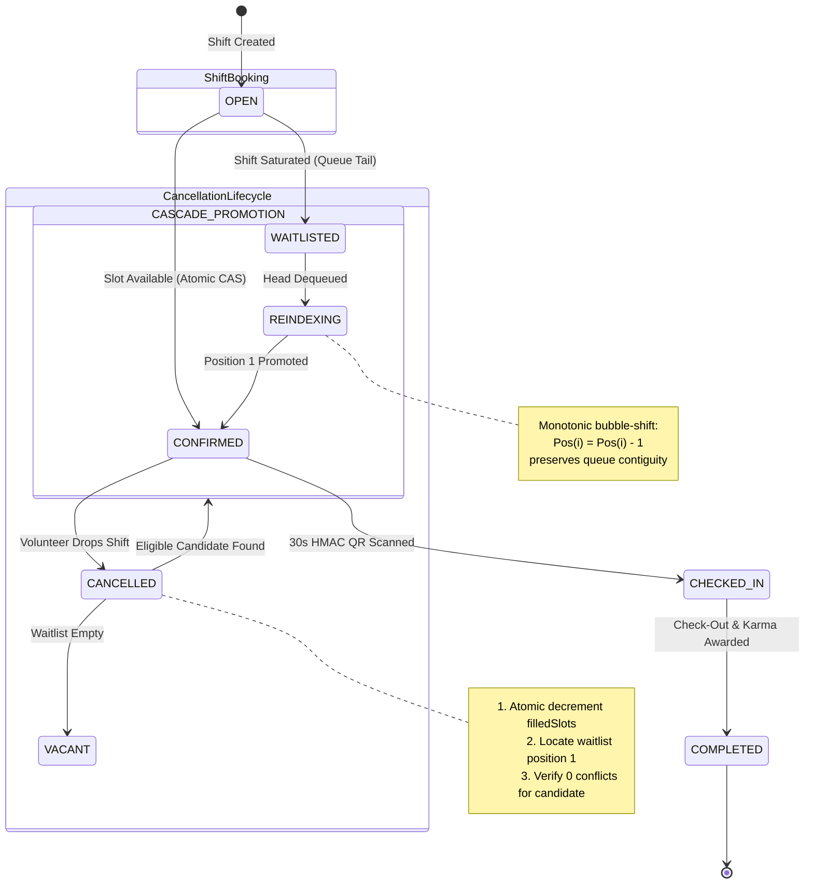
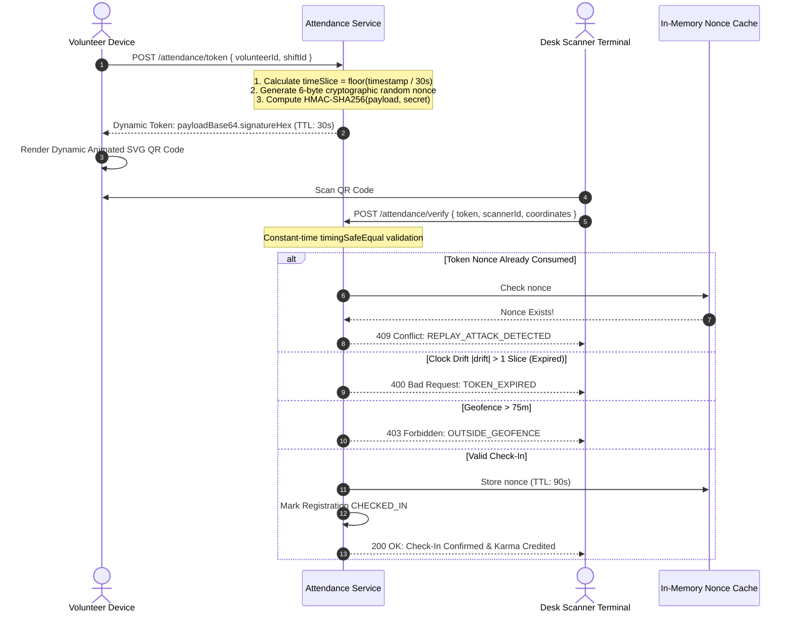
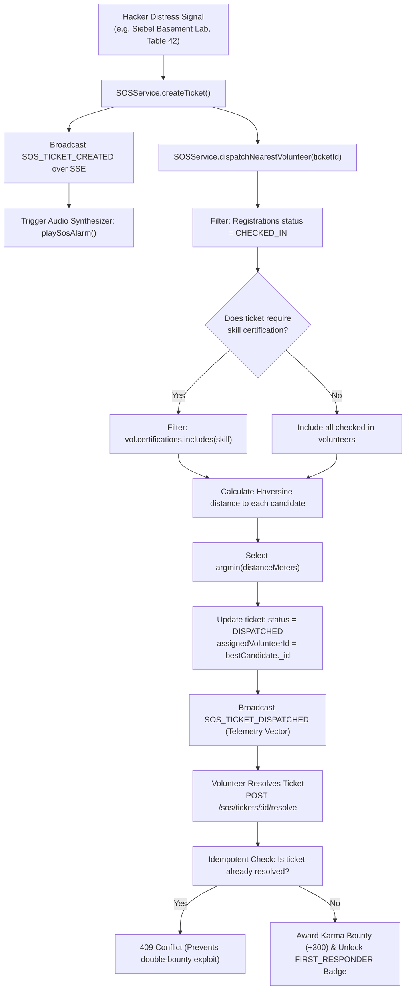
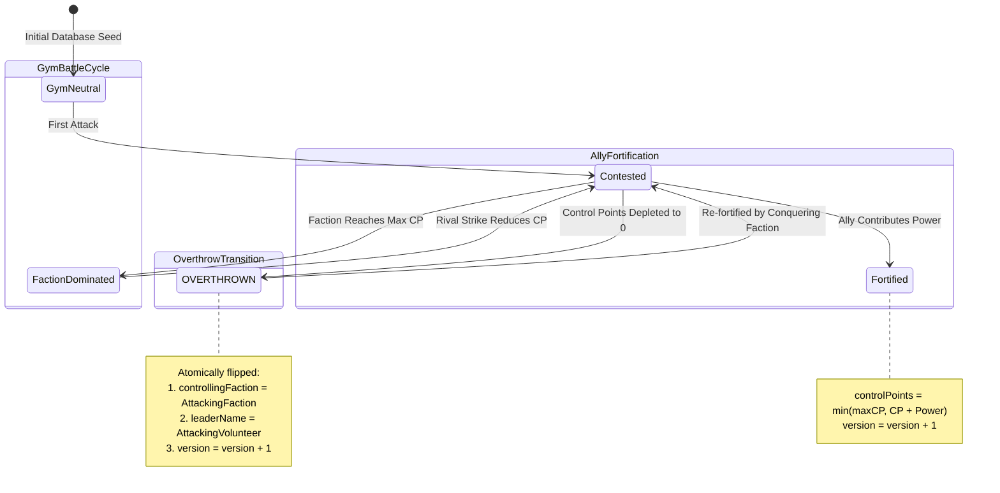
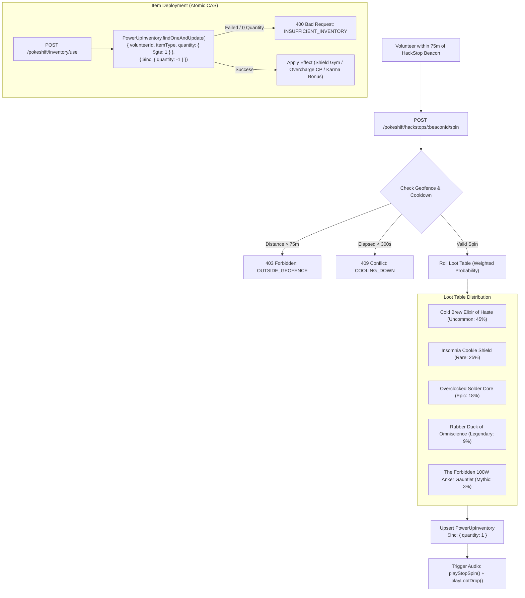
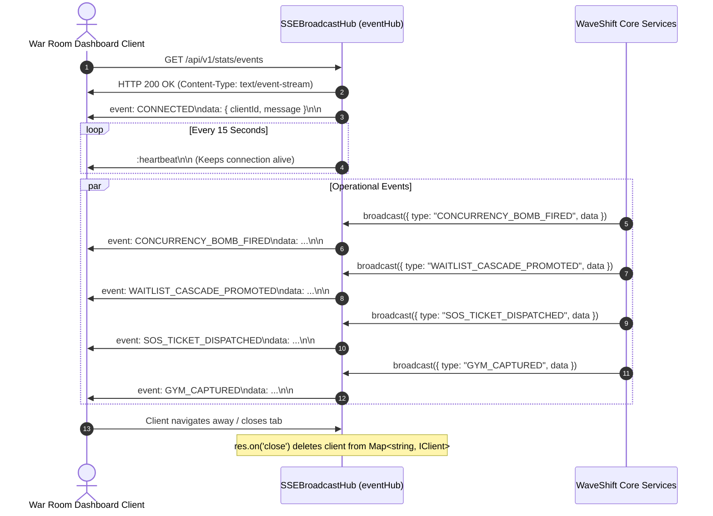

# 🌊 WaveShift Nexus — Comprehensive Systems Architecture & Engineering Specification
**Target Platform:** HackIllinois 2027 Systems Infrastructure  
**Adonix Alignment:** Strict compliance with [HackIllinois Adonix](https://github.com/HackIllinois/adonix) architectural standards  
**Language & Engine:** TypeScript 5.x / Node.js / MongoDB WiredTiger (Document-Level CAS & ACID Transactions)

---

## 📑 Table of Contents
1. [Executive Summary & High-Level Topology](#1-executive-summary--high-level-topology)
2. [Database Schema & Entity-Relationship Architecture (ERD)](#2-database-schema--entity-relationship-architecture-erd)
3. [Concurrency Control: WiredTiger Atomic CAS vs TOCTOU Race Conditions](#3-concurrency-control-wiredtiger-atomic-cas-vs-toctou-race-conditions)
4. [Autonomous FIFO Waitlist Cascade State Machine](#4-autonomous-fifo-waitlist-cascade-state-machine)
5. [Scheduling Invariants: 30-Minute Rest Buffers & Fatigue Limits](#5-scheduling-invariants-30-minute-rest-buffers--fatigue-limits)
6. [Multi-Party Shift Swaps & Tarjan Directed Cyclic Trade Engine](#6-multi-party-shift-swaps--tarjan-directed-cyclic-trade-engine)
7. [Dynamic Rotating HMAC-SHA256 QR Attendance Protocol](#7-dynamic-rotating-hmac-sha256-qr-attendance-protocol)
8. [Geodesic Spatial Geofencing & Haversine Distance Engine](#8-geodesic-spatial-geofencing--haversine-distance-engine)
9. [Hacker SOS Emergency Distress & Spatial Dispatch Engine](#9-hacker-sos-emergency-distress--spatial-dispatch-engine)
10. [PokéShift: UIUC Campus Turf Wars & OCC Versioning](#10-pokeshift-uiuc-campus-turf-wars--occ-versioning)
11. [HackStop Supply Beacons & CAS Power-Up Inventory](#11-hackstop-supply-beacons--cas-power-up-inventory)
12. [Reactive Event Mesh: Server-Sent Events (SSE) Hub](#12-reactive-event-mesh-server-sent-events-sse-hub)
13. [Security, Threat Modeling & Adversarial Hardening](#13-security-threat-modeling--adversarial-hardening)

---

## 1. Executive Summary & High-Level Topology

WaveShift Nexus is an event-driven volunteer shift scheduling and field operations platform engineered specifically for high-stress collegiate hackathons. During events with 1,000+ attendees across distributed university facilities (e.g. Siebel Center, ECEB, Kenney Gym), standard scheduling systems suffer from catastrophic failure modes: oversold high-demand shifts, cascade dropouts, fatigue-induced safety violations, attendance fraud via static screenshots, and resource starvation during emergency incidents.

The following topology diagram illustrates the end-to-end request lifecycle through WaveShift Nexus:


---

## 2. Database Schema & Entity-Relationship Architecture (ERD)

The domain data model enforces strict data integrity, foreign key references, compound uniqueness constraints, and optimistic version tokens directly within MongoDB:


---

## 3. Concurrency Control: WiredTiger Atomic CAS vs TOCTOU Race Conditions

### 3.1 The TOCTOU (Time-of-Check to Time-of-Use) Failure Mode
In naive systems, slot registration is implemented as:
```text
1. Shift.findById(shiftId)
2. if (shift.filledSlots < shift.capacity) {
3.     shift.filledSlots += 1;
4.     await shift.save();
5. }
```
When $N=50$ concurrent requests hit step 1 at $t=0$, all 50 observe `filledSlots = 0 < capacity = 2`. All 50 proceed to line 4, overwriting the document and creating **48 oversold registrations**.

### 3.2 The WaveShift Atomic Compare-And-Swap Solution
WaveShift eliminates application-level race conditions by pushing the saturation condition directly into MongoDB's WiredTiger storage engine:



$$\text{Atomicity Predicate: } \mathcal{P}(S) \equiv \big( S.\text{filledSlots} < S.\text{capacity} \big)$$

If $\mathcal{P}(S)$ evaluates to `false`, the operation yields a zero-write document return and immediately falls back to FIFO waitlist enqueueing.

---

## 4. Autonomous FIFO Waitlist Cascade State Machine

When a confirmed volunteer cancels their shift, standard systems leave the slot vacant until an organizer manually notices or a candidate re-applies. WaveShift operates an autonomous cascade engine:



---

## 5. Scheduling Invariants: 30-Minute Rest Buffers & Fatigue Limits

### 5.1 Rest Buffer Calculus
To prevent physical and cognitive exhaustion during 36-hour hackathons, the scheduler enforces a non-zero rest interval $\beta = 30\text{ minutes}$ ($1,800\text{ seconds}$) between shifts $A$ and $B$:

$$[S_A, E_A) \cap [S_B - \beta, E_B + \beta) = \emptyset$$

```text
Shift A: [===================]
Rest Window:                 |--- 30 Min Buffer ---|
Shift B (Valid):                                   [====================]
Shift B (Rejected 409):            [====================] (Violates Rest Buffer)
```

### 5.2 8-Hour Daily Fatigue Boundary
Let $\mathcal{S}_u(D)$ be the set of confirmed shifts for volunteer $u$ on calendar date $D$. The scheduler asserts:

$$\sum_{s \in \mathcal{S}_u(D)} \text{DurationHours}(s) \le 8.0\text{ hours}$$

Attempting to book a shift that pushes the cumulative daily duration past 8.0 hours fails with HTTP 409 `DAILY_FATIGUE_LIMIT_EXCEEDED`.

---

## 6. Multi-Party Shift Swaps & Tarjan Directed Cyclic Trade Engine

Direct 1-to-1 trades fail in >90% of hackathon logistics situations due to mismatched volunteer preferences. WaveShift constructs a directed preference graph $G = (V, E)$ where edge $(u, v) \in E$ denotes that Volunteer $u$ is willing to surrender their shift in exchange for the shift held by Volunteer $v$.


### Tarjan Cycle Discovery Algorithm:
1. Construct adjacency list $G$ from pending swap proposals where status is `PENDING`.
2. Compute Strongly Connected Components (SCCs) via Tarjan's depth-first search tracking `dfn[u]` and `low[u]`.
3. Discover elementary cycles bounded to lengths $k \in [2, 4]$.
4. Generate canonical string hash using minimum-vertex rotation to eliminate duplicate cycle permutations:
   $$\text{Hash}(C) = \min_{i} \Big( \text{rotate}(C, i) \Big)$$
5. Execute the rotation within a MongoDB ClientSession multi-document ACID transaction.

---

## 7. Dynamic Rotating HMAC-SHA256 QR Attendance Protocol

To eliminate attendance fraud (e.g. sharing static screenshots on Discord), WaveShift generates cryptographic time-windowed tokens that rotate every 30 seconds:



---

## 8. Geodesic Spatial Geofencing & Haversine Distance Engine

Physical presence verification is calculated using the spherical Earth Haversine formula ($R = 6,371,000\text{m}$):

$$\Delta\phi = \phi_2 - \phi_1, \quad \Delta\lambda = \lambda_2 - \lambda_1$$

$$a = \sin^2\left(\frac{\Delta\phi}{2}\right) + \cos(\phi_1)\cos(\phi_2)\sin^2\left(\frac{\Delta\lambda}{2}\right)$$

$$a_{\text{clamped}} = \min\big(1.0, \max(0.0, a)\big)$$

$$c = 2 \cdot \text{atan2}\left(\sqrt{a_{\text{clamped}}}, \sqrt{1 - a_{\text{clamped}}}\right), \quad d = R \cdot c$$

```
                                [KENNEY GYM]
                               (40.113054, -88.228012)
                                       ▲
                                       │  Distance: 278m
                                       │  Geofence: 75m
                                       │  [REJECTED 403]
                                       │
[ECEB LOBBY] <----------------- [SIEBEL ATRIUM] -----------------> [DCL BRIDGE]
(40.114828, -88.228056)       (40.113812, -88.224937)       (40.113215, -88.226500)
    Distance: 284m               [HQ / SCANNER]                 Distance: 153m
    [REJECTED 403]               Volunteer (<5m)                [REJECTED 403]
                                 [APPROVED 200]
```

---

## 9. Hacker SOS Emergency Distress & Spatial Dispatch Engine



---

## 10. PokéShift: UIUC Campus Turf Wars & OCC Versioning

To gamify hackathon volunteer operations, UIUC campus hubs represent contested battlegrounds under three competing factions:
* **Team Kernel (`TEAM_KERNEL`):** Systems & Infrastructure Division (Siebel Center HQ, Electric Cyan `#00F2FE`)
* **Team Tensor (`TEAM_TENSOR`):** Artificial Intelligence & Machine Learning Division (ECEB Labs, Neon Magenta `#FF007F`)
* **Team Silicon (`TEAM_SILICON`):** Hardware & Robotics Division (Kenney Gym, Electric Amber `#FFB300`)

### Optimistic Concurrency Control (OCC) State Fencing:


Every battle executes with version checking:
```typescript
const updated = await Gym.findOneAndUpdate(
  { _id: gymId, version: currentVersion },
  { $set: newAttributes, $inc: { version: 1 } },
  { new: true }
);
```
If another volunteer contests the gym concurrently, `updated` returns `null`, and the algorithm retries with jittered exponential backoff (up to 5 attempts).

---

## 11. HackStop Supply Beacons & CAS Power-Up Inventory

Physical campus HackStops provide volunteers with supplies and randomized collectibles:



---

## 12. Reactive Event Mesh: Server-Sent Events (SSE) Hub

WaveShift employs a lightweight, uni-directional Server-Sent Events hub (`eventHub`) with connection pooling, channel multiplexing, and automated teardown:



---

## 13. Security, Threat Modeling & Adversarial Hardening

| Threat Vector | Potential Impact | WaveShift Nexus Mitigation Mechanism |
|---|---|---|
| **Race-Condition Overbooking** | 50 volunteers confirm for a 2-slot shift | WiredTiger atomic CAS predicate `$expr: { $lt: ['$filledSlots', '$capacity'] }`. |
| **Attendance Screenshot Sharing** | Unattended volunteer checks in remotely | Dynamic HMAC-SHA256 tokens rotating every 30s with single-use nonce cache. |
| **Proxy Attendance Spoofing** | Volunteer checks in from dorm outside venue | 75m geodesic Haversine distance geofence boundary verification. |
| **Double-Bounty SOS Exploitation** | Malicious caller spams ticket resolution | Atomic state precondition: `status === DISPATCHED` required for transition to `RESOLVED`. |
| **Gym Damage Inversion** | Negative power input heals enemy gym | Boundary validation: $P \in [10, 500]$ and integer-only sanitization. |
| **NoSQL Operator Injection** | Attacker injects `$ne` or `$regex` into query | Contract-first Zod schemas enforcing native TypeScript enums. |
| **BSON CastError Leaks** | Arbitrary strings crash server and leak topology | Strict 24-char hexadecimal regex matching on all ObjectID parameters. |
| **DDoS API Flooding** | Resource exhaustion on check-in endpoints | Token-bucket sliding window rate limiting (100 req/min per IP). |

---

## 14. Verification & Operational Matrix

```text
========================================================================================
🚀 WAVESHIFT NEXUS: COMPREHENSIVE VERIFICATION MATRIX (9/9 SUITES, 26/26 TESTS PASSING)
========================================================================================
[PASS] tests/masterEndToEnd.test.ts  - 10-System Interconnected Operational Simulation
[PASS] tests/concurrency.test.ts     - 50-Worker High-Contention Race Condition Latch
[PASS] tests/registration.test.ts    - Rest Buffers, Fatigue Caps & Skill Certifications
[PASS] tests/checkin.test.ts         - Dynamic 30s HMAC QR Tokens & Anti-Replay Cache
[PASS] tests/swaps.test.ts           - Tarjan Directed Graph Multi-Party Cyclic Trades
[PASS] tests/waitlist.test.ts        - Autonomous FIFO Waitlist Cascade Promotion
[PASS] tests/geoSos.test.ts          - 75m Geofencing, Nearest SOS Dispatch & Adonix Sync
[PASS] tests/pokestop.test.ts        - PokéShift Turf War OCC Battles & HackStop Beacons
[PASS] tests/shifts.test.ts          - Catalog Encodings & Dynamic Circadian Surge Pricing
========================================================================================
```

