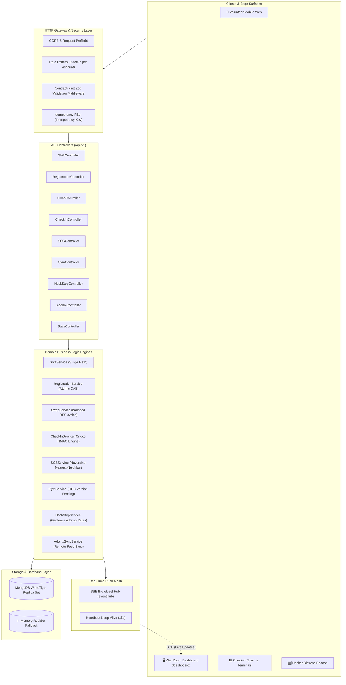
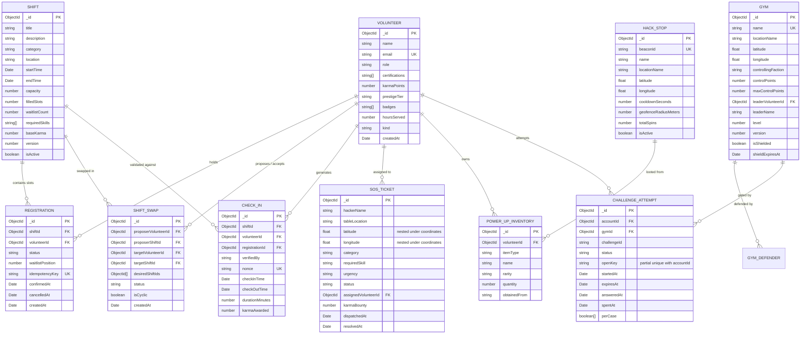
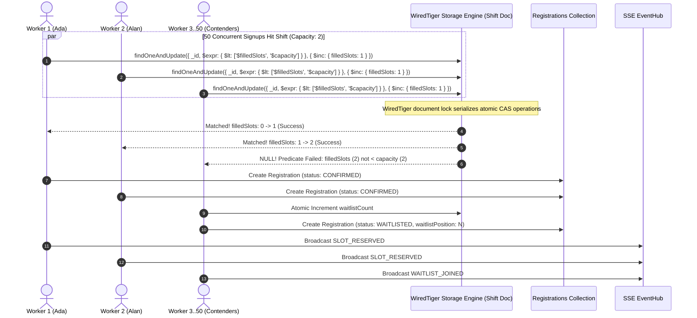
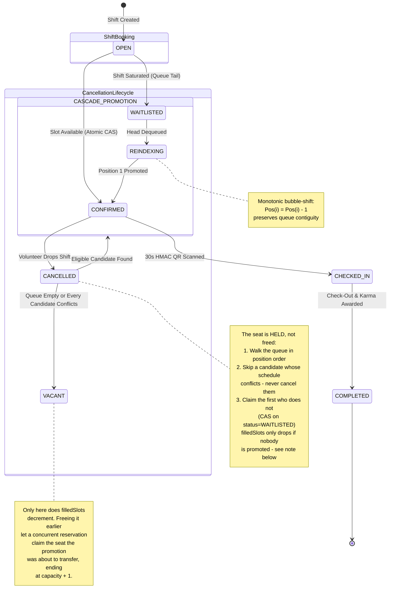
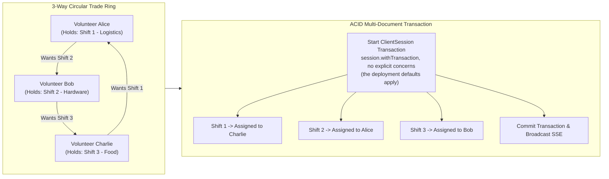
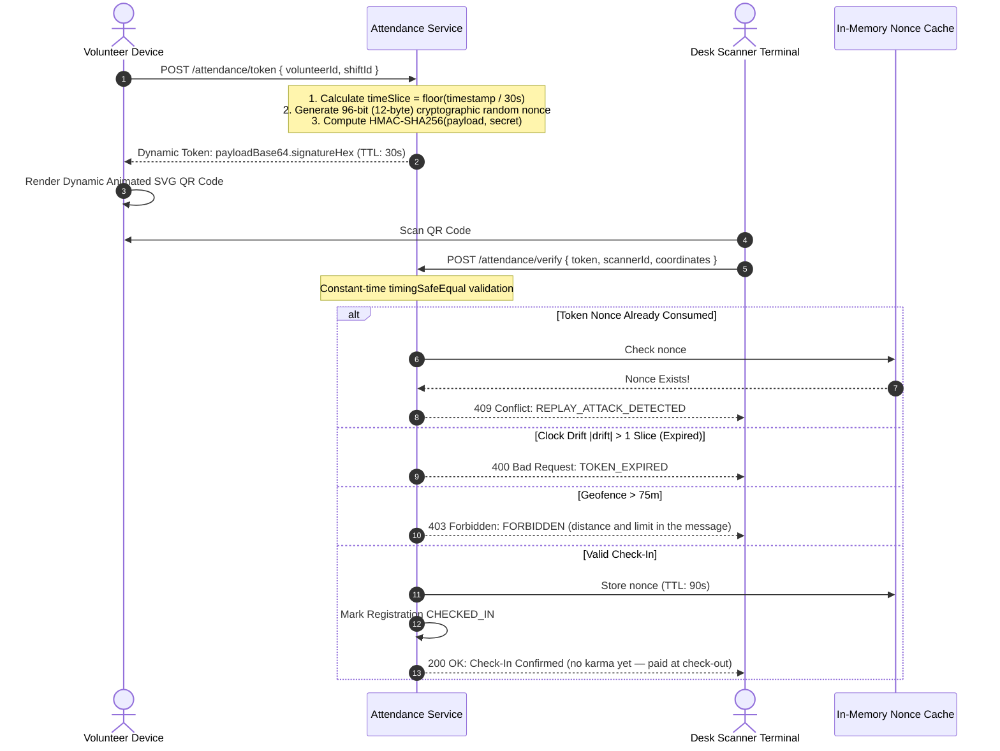
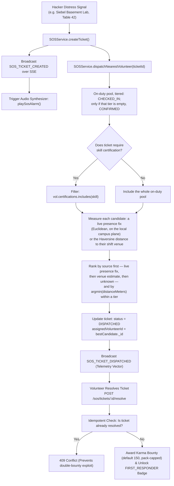
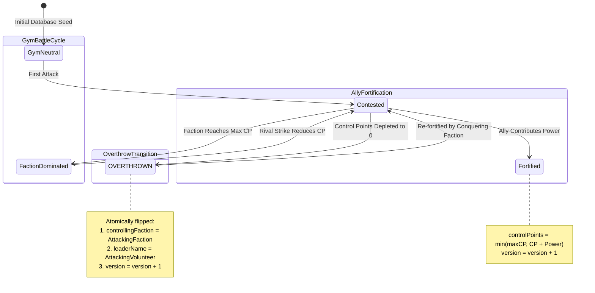
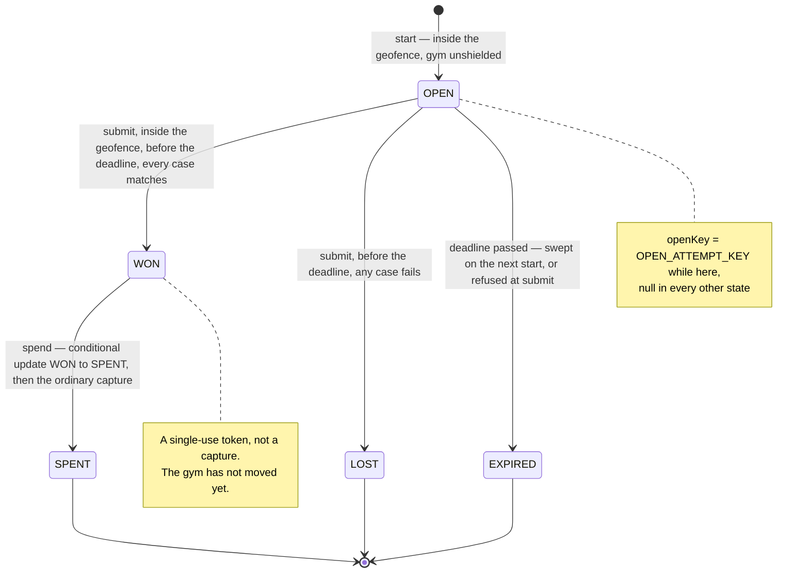
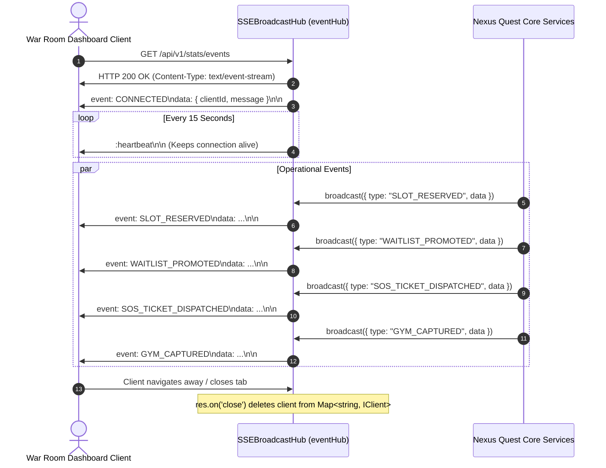

# 🌊 Nexus Quest — Comprehensive Systems Architecture & Engineering Specification
**Target Platform:** HackIllinois 2027 Systems Infrastructure  
**Adonix Alignment:** Strict compliance with [HackIllinois Adonix](https://github.com/HackIllinois/adonix) architectural standards  
**Language & Engine:** TypeScript 5.x / Node.js / MongoDB WiredTiger (Document-Level CAS & ACID Transactions)

> **Scope note.** Sections 3–6 (concurrency, waitlist, scheduling, swaps) describe the
> current code. Sections 1, 2 and 10–15 were written before content packs, plugins, the
> identity layer, WebSocket presence and the tiled campus renderer existed, and they do not
> cover any of them — see `docs/WORKFLOWS.md`, `docs/IDENTITY.md`, `docs/PRESENCE.md`,
> `docs/PLUGINS.md` and `docs/CONTENT-PACKS.md`, which are maintained against the code.
> Constants quoted here are checked against the source but the structure is not yet.

---

## 📑 Table of Contents
1. [Executive Summary & High-Level Topology](#1-executive-summary--high-level-topology)
2. [Database Schema & Entity-Relationship Architecture (ERD)](#2-database-schema--entity-relationship-architecture-erd)
3. [Concurrency Control: WiredTiger Atomic CAS vs TOCTOU Race Conditions](#3-concurrency-control-wiredtiger-atomic-cas-vs-toctou-race-conditions)
4. [Autonomous FIFO Waitlist Cascade State Machine](#4-autonomous-fifo-waitlist-cascade-state-machine)
5. [Scheduling Invariants: 30-Minute Rest Buffers & Fatigue Limits](#5-scheduling-invariants-30-minute-rest-buffers--fatigue-limits)
6. [Multi-Party Shift Swaps & the Directed Cyclic Trade Engine](#6-multi-party-shift-swaps--the-directed-cyclic-trade-engine)
7. [Dynamic Rotating HMAC-SHA256 QR Attendance Protocol](#7-dynamic-rotating-hmac-sha256-qr-attendance-protocol)
8. [Geodesic Spatial Geofencing & Haversine Distance Engine](#8-geodesic-spatial-geofencing--haversine-distance-engine)
9. [Hacker SOS Emergency Distress & Spatial Dispatch Engine](#9-hacker-sos-emergency-distress--spatial-dispatch-engine)
10. [PokéShift: UIUC Campus Turf Wars & OCC Versioning](#10-pokeshift-uiuc-campus-turf-wars--occ-versioning)
11. [HackStop Supply Beacons & CAS Power-Up Inventory](#11-hackstop-supply-beacons--cas-power-up-inventory)
12. [Reactive Event Mesh: Server-Sent Events (SSE) Hub](#12-reactive-event-mesh-server-sent-events-sse-hub)
13. [Security, Threat Modeling & Adversarial Hardening](#13-security-threat-modeling--adversarial-hardening)
14. [NEXUS OS War Room: The WebGL Campus Renderer](#14-nexus-os-war-room-the-webgl-campus-renderer)

---

## 1. Executive Summary & High-Level Topology

Nexus Quest is an event-driven volunteer shift scheduling and field operations platform engineered specifically for high-stress collegiate hackathons. During events with 1,000+ attendees across distributed university facilities (e.g. Siebel Center, ECEB, Kenney Gym), standard scheduling systems suffer from catastrophic failure modes: oversold high-demand shifts, cascade dropouts, fatigue-induced safety violations, attendance fraud via static screenshots, and resource starvation during emergency incidents.

The following topology diagram illustrates the end-to-end request lifecycle through Nexus Quest:



---

## 2. Database Schema & Entity-Relationship Architecture (ERD)

> The diagram below covers the scheduling and game core. **[docs/DATA-MODEL.md](docs/DATA-MODEL.md)
> is the complete reference** — all twenty-four collections including the four economy ledgers,
> the two auth tables and the audit tables this ERD does not draw — and explains why each one is
> a separate collection rather than a field on something else. `challengeAttempt`, the gauntlet's
> collection (§10), is the twenty-fourth and is drawn below.

The domain data model enforces strict data integrity, foreign key references, compound uniqueness constraints, and optimistic version tokens directly within MongoDB:



---

## 3. Concurrency Control: WiredTiger Atomic CAS vs TOCTOU Race Conditions

### 3.1 The TOCTOU (Time-of-Check to Time-of-Use) Failure Mode
In naive systems, slot registration is implemented as:
```text
1. Shift.findById(shiftId)
2. if (shift.filledSlots < shift.capacity) {
3.     shift.filledSlots += 1;
4.     await shift.save();
5. }
```
When $N=50$ concurrent requests hit step 1 at $t=0$, all 50 observe `filledSlots = 0 < capacity = 2`. All 50 proceed to line 4, overwriting the document and creating **48 oversold registrations**.

### 3.2 The atomic compare-and-swap solution
Nexus Quest eliminates application-level race conditions by pushing the saturation condition directly into MongoDB's WiredTiger storage engine:



$$\text{Atomicity Predicate: } \mathcal{P}(S) \equiv \big( S.\text{filledSlots} < S.\text{capacity} \big)$$

If $\mathcal{P}(S)$ evaluates to `false`, the operation yields a zero-write document return and immediately falls back to FIFO waitlist enqueueing.

---

## 4. Autonomous FIFO Waitlist Cascade State Machine

When a confirmed volunteer cancels their shift, standard systems leave the slot vacant until an organizer manually notices or a candidate re-applies. Nexus Quest operates an autonomous cascade engine:



---

## 5. Scheduling Invariants: 30-Minute Rest Buffers & Fatigue Limits

### 5.1 Rest Buffer Calculus
To prevent physical and cognitive exhaustion during 36-hour hackathons, the scheduler enforces a non-zero rest interval $\beta = 30\text{ minutes}$ ($1,800\text{ seconds}$) between shifts $A$ and $B$:

$$[S_A, E_A) \cap [S_B - \beta, E_B + \beta) = \emptyset$$

```text
Shift A: [===================]
Rest Window:                 |--- 30 Min Buffer ---|
Shift B (Valid):                                   [====================]
Shift B (Rejected 409):            [====================] (Violates Rest Buffer)
```

### 5.2 8-Hour Daily Fatigue Boundary
Let $\mathcal{S}_u$ be volunteer $u$'s active shifts — CONFIRMED, CHECKED_IN or SWAP_PENDING — and let $D$ be a calendar date in America/Chicago wall-clock time, which is the zone the rule is written in because the rule is about a person's night and a UTC boundary falls at six in the evening locally. Hours are attributed to $D$ by *overlap*, not by which day a shift starts on, so an overnight shift is weighed against both days it spans:

$$\sum_{s \in \mathcal{S}_u} \text{HoursOverlapping}(s, D) \le 8.0\text{ hours}$$

The assertion is made for every date the shift being booked touches. Attempting to book a shift that pushes any of those days past 8.0 hours fails with HTTP 409 `DAILY_FATIGUE_EXCEEDED`.

---

## 6. Multi-Party Shift Swaps & the Directed Cyclic Trade Engine

Direct 1-to-1 trades fail in >90% of hackathon logistics situations due to mismatched volunteer preferences. Nexus Quest constructs a directed preference graph $G = (V, E)$ whose nodes are *offers* rather than volunteers: a node is the pair `volunteerId::shiftId`, one volunteer together with the one shift they are putting up. An edge $(u, v) \in E$ denotes that the holder of offer $u$ is willing to surrender the shift in $u$ in exchange for the shift in $v$. The distinction is load-bearing — a volunteer with a pending proposal against each of two shifts they hold is two nodes, and collapsing them onto one lost track of which of their shifts was actually on the table for a given ring.



### Cycle discovery (`src/common/utils/cycleFinder.ts`)

Bounded elementary-cycle enumeration by depth-first search. Not Tarjan, and not an SCC
decomposition — this document claimed both for a while, and the code has never contained
either. The rings being looked for are two to four people long in a graph of at most a few
hundred pending proposals, so the asymptotic win from condensing components first buys
nothing and the direct search is the whole algorithm.

1. Build the adjacency list $G$ from `PENDING` proposals, one node per proposal: an edge
   $u \rightarrow v$ exists when the offer $u$ names the shift on offer at $v$ as wanted.
2. From each node in sorted order, walk depth-first with the start node held fixed, bounded
   at $k \in [2, 4]$ and guarded by an on-stack set so a node is never re-entered within a
   walk.
3. Deduplicate by construction rather than by hashing afterwards: an edge to a node
   lexicographically smaller than the start node is not traversed, so each cycle is
   discovered exactly once, from its smallest member. There is no canonical-rotation hash.
4. Execute the rotation inside one MongoDB `ClientSession` transaction — every leg moves or
   none does — after validating each leg's certifications and schedule conflicts up front.

---

## 7. Dynamic Rotating HMAC-SHA256 QR Attendance Protocol

To eliminate attendance fraud (e.g. sharing static screenshots on Discord), Nexus Quest generates cryptographic time-windowed tokens that rotate every 30 seconds:



---

## 8. Geodesic Spatial Geofencing & Haversine Distance Engine

Physical presence verification is calculated using the spherical Earth Haversine formula ($R = 6,371,000\text{m}$):

$$\Delta\phi = \phi_2 - \phi_1, \quad \Delta\lambda = \lambda_2 - \lambda_1$$

$$a = \sin^2\left(\frac{\Delta\phi}{2}\right) + \cos(\phi_1)\cos(\phi_2)\sin^2\left(\frac{\Delta\lambda}{2}\right)$$

$$a_{\text{clamped}} = \min\big(1.0, \max(0.0, a)\big)$$

$$c = 2 \cdot \text{atan2}\left(\sqrt{a_{\text{clamped}}}, \sqrt{1 - a_{\text{clamped}}}\right), \quad d = R \cdot c$$

```
                                [KENNEY GYM]
                               (40.113054, -88.228012)
                                       ▲
                                       │  Distance: 274.7m
                                       │  Geofence: 75m
                                       │  [REJECTED 403]
                                       │
[ECEB LOBBY] <----------------- [SIEBEL ATRIUM] -----------------> [DCL BRIDGE]
(40.114828, -88.228056)       (40.113812, -88.224937)       (40.113215, -88.226500)
    Distance: 288.3m             [HQ / SCANNER]                 Distance: 148.6m
    [REJECTED 403]               Volunteer (<5m)                [REJECTED 403]
                                 [APPROVED 200]
```

---

## 9. Hacker SOS Emergency Distress & Spatial Dispatch Engine



---

## 10. PokéShift: UIUC Campus Turf Wars & OCC Versioning

To gamify hackathon volunteer operations, UIUC campus hubs represent contested battlegrounds under three competing factions:
* **Team Kernel (`TEAM_KERNEL`):** Systems & Infrastructure Division (Siebel Center HQ, Electric Cyan `#22d3ee`)
* **Team Tensor (`TEAM_TENSOR`):** Artificial Intelligence & Machine Learning Division (ECEB Labs, Soft Violet `#a78bfa`)
* **Team Silicon (`TEAM_SILICON`):** Hardware & Robotics Division (Kenney Gym, Electric Amber `#fbbf24`)

### Optimistic Concurrency Control (OCC) State Fencing:


Every battle executes with version checking:
```typescript
const updated = await Gym.findOneAndUpdate(
  { _id: gymId, version: currentVersion },
  { $set: newAttributes, $inc: { version: 1 } },
  { new: true }
);
```
If another volunteer contests the gym concurrently, `updated` returns `null`, and the algorithm retries with jittered backoff (up to 5 attempts; the pause is `Math.random() * 40 * attempt` ms, linear in the attempt rather than exponential).

### The Gauntlet: the last hit on a rival gym is a coding challenge

Control points alone no longer take a rival gym. The switch is
`event.gauntlet.requiredForCapture`: it defaults to **false** in `src/content/schema.ts`, the
shipped `content/hackillinois-2027/event.json` sets it true, and `content/example-campus` ships
no `challenges.json` at all — so a fork keeps the capture behaviour it already had until it opts
in, and `GauntletService.requiredForCapture()` additionally refuses a `true` from a pack that has
no challenges to serve.

Exactly one branch changes. A strike that would have flipped a rival gym instead floors it at
**1 control point**, and the response says what would finish it; the flip needs a challenge win
spent through `POST /pokeshift/gauntlets/:attemptId/spend`. Reinforcing an ally, claiming neutral
ground and every earlier strike behave as before, because gating those would break the first
thirty seconds of play for the sake of the last one.

**It verifies answers, not programs.** The judge in `src/services/gauntlet.service.ts` is
`normalise` → HMAC-SHA256 → `timingSafeEqual` against a digest the pack ships. Nothing is
executed: no `vm`, no worker, no container, no third-party runner and no new dependency, so
there is nothing to sandbox. Answers can only be digests because `src/app.ts` serves the pack
directory publicly under `/dashboard/content` — plaintext written into a pack file would be a
download. The plaintext lives in `design/challenges/hackillinois-2027.json`, which is neither
served nor copied into the image, and `npm run gauntlet:hashes` (`scripts/gauntletHashes.ts`)
turns it into the digests in `content/hackillinois-2027/challenges.json` by calling the same
`GauntletService.hashFor` the judge uses. `challengeCaseSchema` is `.strict()` and rejects a
plaintext `answer` field outright rather than ignoring it.

Digests are keyed on the pack's own `answerSalt`, not on `QR_HMAC_SECRET`, and that is a trade
rather than an oversight: outside production an unset `QR_HMAC_SECRET` is replaced with an
ephemeral per-boot value (`src/config/env.ts:216`), so a pack keyed on it would stop judging
correctly the next morning. Be exact about what the salt buys —
**it stops the answer being read, not guessed.** The answer space for "what does this print" is
small and candidates can be hashed offline, and every player of a challenge sees the same input,
so an answer is shareable. What bounds cheating here is physical rather than cryptographic: the
geofence is checked at start **and** again at submit, the attempt carries a server-side deadline,
one submission ends it, and one attempt is open per account at a time.

**Layering.** Nothing new was invented for it — three routes, one controller, one service, one
collection:

```text
  Router      src/routes/v1/pokestop.routes.ts     pokeShiftRouter, all three requireSession
                POST /pokeshift/gyms/:id/gauntlet             open an attempt
                POST /pokeshift/gauntlets/:attemptId/submit   judge it
                POST /pokeshift/gauntlets/:attemptId/spend    spend a win on the capture
  Controller  src/controllers/gym.controller.ts    startGauntlet / submitGauntlet /
                spendGauntlet — resolve the actor with resolveActorId, shape the response,
                judge nothing
  Service     src/services/gauntlet.service.ts     start / submit / spend: geofence, deadline,
                the HMAC judge, and the single-spend conditional update
  Model       src/models/challengeAttempt.model.ts the attempt row, its partial unique
                index and the lookup index on (accountId, gymId, createdAt)
```

All three routes carry `requireSession`, unlike `POST /gyms/:id/battle` beside them, which stays
ungated for the legacy demo posture: these three create and move a durable row owned by a named
person, and the spend pays karma through the capture path.

#### The ChallengeAttempt state machine



`WON` and `SPENT` are separate states on purpose: winning mints a token, and redeeming it is a
second request against `GymService`. A losing submission keeps its per-case verdicts in `perCase`
so a player can see which case they missed without being shown the answer. `EXPIRED` is reached
two ways, both conditional on the deadline — a sweep of the account's own stale rows when it next
starts an attempt, and the submit path, which refuses a correct answer that arrives late.

#### Two invariants the database owns

Neither is a count followed by a write, because that shape cannot survive two requests in the
same millisecond — the shape the compound unique index on `BoothScan` already exists to prevent.

| Invariant | Mechanism | Under twenty concurrent requests |
|---|---|---|
| One open attempt per account | Partial unique index on `{ accountId, openKey }`, filtered to rows where `openKey` is a string. `openKey` holds the constant `OPEN_ATTEMPT_KEY` while OPEN and `null` afterwards, so finished rows leave the index entirely and their nulls cannot collide. | One insert; nineteen duplicate-key errors, returned as 409. |
| One capture per win | `findOneAndUpdate` filtered on `status: 'WON'`, setting `SPENT`. The filter names the state the caller believes they are in. | One spend; nineteen 409s. |

The third invariant is the one section 10 already described: the capture itself is still the
`version` compare-and-swap on the gym document.

#### Composing with GymService rather than copying it

`spendGauntlet` burns the token and then calls the ordinary capture path —
`GymService.battleOrContribute(gymId, actor, faction, challenge.capturePower, coordinates, { viaGauntlet: true })`.
The gauntlet is an argument to the code that already owns the CAS retry loop, the shield rule,
the faction lock and the karma payout, not a second implementation of it; `opts.viaGauntlet` is
read at exactly one place, the branch that would otherwise flip the gym.

* `capturePower` is bounded to 10–500 in `src/content/challenges.schema.ts`, the same range
  `battleGymSchema` accepts for `power`, so a won gauntlet cannot express a battle the ordinary
  route would refuse.
* Karma is the existing payout: `awardBattleKarma` under the existing `GYM` source and its
  per-volunteer cooldown. No new karma source was added — `crossValidate` refuses a pack that
  leaves a declared source unpriced, so a new key in `KARMA_SOURCES` would boot-break every fork
  that pulled the change without editing its pack.
* The order costs something, and it is worth naming: the token is burned before the capture runs,
  so a capture that throws afterwards loses the win. That is the same survivable direction the
  karma payout already chose — the alternative is a compensating write against a document other
  players are contending for.

One authored field is not paid: a challenge's `rewardKarma` is validated, carried, and reported
in the submit response, and nothing credits it — the karma a capture pays is the ordinary battle
payout. It is recorded in `docs/LIMITATIONS.md` rather than fixed here, because paying it is an
economy decision.

The client half is the `CHALLENGE` command in the encounter modal (`public/game.js`), which posts
the player's own position, renders the prompt and cases, counts down from the server's
`expiresAt`, and on a win posts the spend. `tests/gauntlet.test.ts` is the suite: it asserts the
off-campus refusal at both ends, the deadline, the served payload carrying no digest, and both
concurrency invariants at twenty workers.

---

## 11. HackStop Supply Beacons & CAS Power-Up Inventory

Physical campus HackStops provide volunteers with supplies and randomized collectibles:


---

## 12. Reactive Event Mesh: Server-Sent Events (SSE) Hub

Nexus Quest employs a lightweight, uni-directional Server-Sent Events hub (`eventHub`) with connection pooling, channel multiplexing, and automated teardown:



---

## 13. Security, Threat Modeling & Adversarial Hardening

| Threat Vector | Potential Impact | Nexus Quest Mitigation Mechanism |
|---|---|---|
| **Race-Condition Overbooking** | 50 volunteers confirm for a 2-slot shift | WiredTiger atomic CAS predicate `$expr: { $lt: ['$filledSlots', '$capacity'] }`. |
| **Attendance Screenshot Sharing** | Unattended volunteer checks in remotely | Dynamic HMAC-SHA256 tokens rotating every 30s with single-use nonce cache. |
| **Proxy Attendance Spoofing** | Volunteer checks in from dorm outside venue | Geodesic Haversine distance against the venue's own radius — `venues.<KEY>.radiusMeters`, else `event.campus.geofenceMeters`, else 75 m. Coordinates are mandatory on this route in every posture. |
| **Double-Bounty SOS Exploitation** | Malicious caller spams ticket resolution | The transition table is the precondition, and it is checked atomically: only a ticket still in a resolvable state moves to `RESOLVED`, so a second attempt matches nothing and the bounty pays once. Note that `OPEN` **is** resolvable — a bystander already on scene may close a ticket nobody dispatched, which is deliberate; the guard is single-transition, not dispatch-ordering. |
| **Gym Damage Inversion** | Negative power input heals enemy gym | Boundary validation: $P \in [10, 500]$, checked twice — by the Zod contract and again in the service. Note it is a bound on the range only; a fractional power passes. |
| **NoSQL Operator Injection** | Attacker injects `$ne` or `$regex` into query | Contract-first Zod schemas enforcing native TypeScript enums. |
| **BSON CastError Leaks** | Arbitrary strings crash server and leak topology | Strict 24-char hexadecimal regex matching on all ObjectID parameters. |
| **DDoS API Flooding** | Resource exhaustion on check-in endpoints | Layered limiters: 300/min per account, 600/min anonymous per IP, a 3,000/min per-IP ceiling, 90/min for mutations and 30/min for credential exchanges. |

---

## 14. NEXUS OS War Room: The WebGL Campus Renderer

The dashboard renders the live operation on a 3D model of the actual University
of Illinois Urbana-Champaign campus. Fourteen real landmarks are the contestable
territory gyms, so a captured stronghold is a recognisable building rather than
an abstract marker.

### 14.1 Why hand-written WebGL2

`src/app.ts` serves the dashboard under a Content-Security-Policy whose
`script-src` is `'self'` — no `'unsafe-inline'`. A CDN build of three.js is blocked
outright, and vendoring a full engine to extrude a city of footprints is
disproportionate. The hand-written layer is about 1,070 lines across two files:
`public/gl/glx-geometry.js` is the pure, worker-safe half — mat4/vec3, geometry
generators, ear-clipping triangulation and the static batcher — and
`public/gl/glx-gl.js` is the WebGL2 plumbing, programs, VAOs and half-float
render targets. `public/gl/glx.js` is a seven-line barrel that re-exports both
so older imports keep resolving. `public/gl/campus3d.js` is the scene.

### 14.2 Data provenance

The city is not hand-authored. `design/build-campus.py` bakes four cached
OpenStreetMap extracts (ODbL 1.0, fetched via the Overpass API one sub-box at a
time and cached under `design/osm/cache/`, which `.gitignore` excludes — the
committed part is the query templates in `design/pipeline/queries/` and
`design/osm/manifest.json`, which records a sha256 per response so a refetch can
be compared against the one this bake used) into `content/<pack>/campus/`
(tiled; the single-file `public/gl/uiuc-campus.json` no longer exists):

```text
  design/osm/cache/buildings_*.json   16 sub-boxes   9872 building ways
  design/osm/cache/extra_*.json       parks, stadiums, artwork nodes, highways
  design/osm/cache/detail_*.json      trees, lamps, water, rail, parking, fountains
  design/osm/cache/props_*.json       benches, bins, racks, fences, pitches, steps
                    │
                    ▼  build-campus.py
      ┌─────────────────────────────────────────────┐
      │ • project WGS84 → local metric frame        │  origin = Main Quad
      │   (+x east, +z south, 10 m per world unit)  │  40.10746, -88.22713
      │ • Douglas-Peucker simplify at 1.1 m         │
      │ • height from OSM height= / building:levels │  1065 buildings tagged
      │ • resolve 14 monuments by name, then by     │
      │   proximity (<55 m, no double-claiming)     │
      └─────────────────────────────────────────────┘
                    │
                    ▼
  content/<pack>/campus/       124 tiles + index.json
    9,188 building footprints · 1,994 roads · 467 lawns · 14 monuments · 124 tiles
```

Landmark coordinates in the pack's `venues.json` were cross-checked against OSM
building centroids while building the map. That audit corrected several venue
positions — Kenney Gym was ~450 m south of its true location — so the geofencing
engine and the map agree on where campus is.

They agree by construction now rather than by audit: `src/common/utils/geo.ts`
derives `VENUE_COORDINATES` from `pack.venues`, so there is one set of
coordinates rather than two that have to be kept in step. It used to hold its own
hard-coded venue table — byte-for-byte identical to the pack's, and checked by
nothing — which meant a fork editing `venues.json` moved the map pin and left the
geofence where it was.

One monument is massed from its verified centroid rather than an outline: Alma
Mater is a `tourism=artwork` node, so the pipeline boxes it from the coordinate
and flags it `src: "synth"` in the model, so the distinction stays visible
rather than being quietly implied. Every other landmark, ECEB and the Main
Library included, resolved to a real `building=*` way once the extract was
widened to the whole campus, and carries `src: "osm"`.

### 14.3 Render pipeline

```text
   ┌── pass 1 ─────────────────────────────────────────────┐
   │  ground plane   procedural grid + range rings + sweep │
   │  streamed tiles 500 m each, baked in a worker         │  ← public/gl/tiles.js
   │  decal batch    streets + lawns, ONE draw call        │
   │  monuments      14 × footprint + landmark crown       │
   │  actors         volunteers / beacons / distress cones │
   │  additive       auras, geofence rings, shockwaves     │
   └───────────────────────┬───────────────────────────────┘
                           ▼  RGBA16F target
   ┌── pass 2: bloom ──────────────────────────────────────┐
   │  bright pass (soft-knee threshold 0.62) → half res    │
   │  3 × separable 9-tap Gaussian (H then V)              │
   └───────────────────────┬───────────────────────────────┘
                           ▼
   ┌── pass 3: composite ──────────────────────────────────┐
   │  scene + bloom · ACES tonemap · chromatic aberration  │
   │  scanlines · vignette · film grain                    │
   └───────────────────────────────────────────────────────┘
```

Two details carry most of the visual weight:

- **Static batching.** 9,188 buildings as 9,188 draw calls stutters on integrated
  GPUs. `mergeStatic()` bakes position, normal, per-vertex colour and emissive
  into one interleaved buffer, and the tile baker runs it once per 500 m tile —
  so the ambient city costs one solid and one decal `drawElements` per resident
  tile (a few dozen at campus-wide zoom, not thousands), plus one instanced draw
  for the greenery. The superseded single-file bake merged the whole core into
  one buffer and drew it in three calls; that path survives only as the schema 1
  fallback. Only the 14 monuments are dynamic, because only they change colour
  when a faction captures them.
- **Analytic LOD on the window lights** (and, since the fidelity pass, on every procedural material). Facades carry a procedural window grid
  keyed on a per-cell hash. Left unguarded it aliases into sparkling noise once
  a cell falls below a pixel, so the shader measures the cell's screen
  footprint with `fwidth()` and fades the pattern out — the reasoning a mip
  chain applies, done analytically because the pattern has no texture.

### 14.4 Live binding

| Domain event | Map response |
|---|---|
| `GYM_CAPTURED` / `GYM_ATTACKED` | monument recolours to the holding faction; shockwave ring |
| Filled shift slot | a crystal enters orbit around that shift's venue |
| `HACKSTOP_SPUN` | beacon pulses; its 75 m geofence ring is drawn to scale |
| `SOS_TICKET_CREATED` | distress cone at the ticket's real coordinates, alarm rings |
| Monument click | camera eases in; garrison, level and control points open in the rail |

Monument labels are HTML positioned from projected world coordinates each
frame, not canvas text — they stay crisp at any zoom and inherit page
typography.

---

### 14.5 Fidelity pass — reference-driven materials and surveyed detail

A second pass pushed the model from "a city of boxes" toward the actual campus.
Everything in it is traceable to a source in the repo.

**Surveyed detail (design/pipeline/queries/detail.overpass.tpl →
design/osm/cache/detail_*.json).** A third Overpass extract adds the layers OSM
maps individually. Over the whole-campus bbox it currently returns **6,657
`natural=tree` nodes** (the elm rows on the Quad are real positions; generated
rows only fill gaps > 12 m from a surveyed tree, which is `merge_trees` in
`design/pipeline/detail.py`), 113 street lamps, 115 water features including
Boneyard Creek, the Illinois Central rail line, 839 parking areas, 22 fountains,
and `roof:shape` where tagged. After the generated fill and the area filters the
shipped index reports 9,255 trees, 1,042 lamps, 114 water features, 673 parking
pads and 21 fountains; `content/<pack>/campus/index.json` is the authoritative
count, and the smaller figures an older draft of this section carried were the
superseded core-bbox bake. Each tile bakes into a buildings-plus-roof-caps
batch, a ground-decal batch and instanced greenery.

**Reference photographs (design/refs/).** Ten Wikimedia Commons photographs
of the monuments were fetched and read; `design/refs/MATERIALS.md` records the
albedo, trim and roof of each building as observed, and corrected the brief
in several places (Altgeld is grey rusticated limestone under a red terracotta
spire, not orange sandstone; Foellinger's dome is verdigris; the Union carries
a white cupola over slate). The official brand palette was verified against
brand.illinois.edu: Illini Orange `#FF5F05`, Illini Blue `#13294B`, and the
secondary set (Patina `#007E8E` is, conveniently, the verdigris).

**Procedural materials (public/gl/materials.js).** Twenty-eight surfaces —
brick with mortar courses, grey and buff limestone, verdigris (flat and
ribbed for domes), slate, terracotta tile, glass curtain wall, ribbed concrete,
asphalt with centre line, walk, lawn, canopy, water, rail ballast, bronze,
granite, and the six the whole-campus facade classifier
(`design/pipeline/facade.py`) needs for the ambient blocks: clapboard, precast,
metal panel, dark glass, roof membrane and standing seam — as pure GLSL
functions of world position. No textures: the CSP
forbids them and the patterns are metric anyway (a brick is 0.2 × 0.065 m at
10 m per world unit). Every `fwidth()` is evaluated at the top of
`material()` outside any branch, and each pattern fades to its flat albedo once
a cell drops below ~1 px, so the campus reads as solid mass from altitude and
as coursed brick from the Quad.

```text
  static batch vertex:  pos · nrm · colour · emissive · [matId, nightTint] · [across, along]
                                                          ▲                    ▲
                        mergeStatic() assigns per piece ──┘   ribbonGeometry ──┘ (centre lines, rails)

  fragment:  s = material(vMat, world, N, t, extras)      one call, unconditional
             albedo = s.albedo × tint · N' = N + s.nrm · rim × (1 − rough)
             + window lights · + radar sweep · fog → HDR target → bloom → composite
```

Monuments take a `uMat` per draw, inferred from the material reference each
crown piece already used (`MAT.copper → verdigris`, `MAT.tile → terracotta`,
`MAT.trim → whiteTrim`, State Farm's concrete → ribbed with `uRibCenter` at the
building centre). A viewer-side floodlight term lets a monument read in its
own material at night instead of dissolving into blue ambient.

**Sky, fog, cinema.** A starfield pass with an Industrial→Illini-blue
gradient and orange skyglow replaces the flat clear colour; height fog is
gated to campus-wide zoom so it never muddies a close-up. The dashboard's
Campus Grid is now the full-width hero with a telemetry strip (fps, buildings,
monuments, camera distance) and a cinematic mode that hides the chrome
(Escape exits). Clicking a monument opens a dossier from
`content/<pack>/monuments-info.json` — year, architect, style and three facts per
landmark, sourced from Wikipedia and flagged `approximate` where no article
exists.

**What is still approximate.** Alma Mater has no building way in OSM — it is a
`tourism=artwork` node — so it is massed from its verified centroid
(`src: "synth"`) and drawn as a low-poly figure group rather than a sculpture. The stadium is a tiered ellipse with
end blocks rather than a true open horseshoe mesh. Only 289 of the 9,872
building ways in the extract carry `roof:shape`, so the great majority of roofs
are inferred from type, area and height by `design/pipeline/roofs.py` rather
than surveyed.

---

### 14.6 Nexus Quest — the retro game layer

The dashboard's chrome was rebuilt as a pixel-art game UI after two polished
"ops console" passes were judged generic. Three directions were mocked in
OpenPencil (`design/directions/{gameboy,snes,neoretro}.mjs`, rendered to
`design/exports/<dir>/`); **Neo-retro indie** was chosen — Silkscreen, Jersey
10, Pixelify Sans and VT323, hard 4 px offset shadows, 4 px chamfer notches,
tab buttons that depress, sticker badges, a Boneyard-duck mascot — borrowing
the SNES direction's battle window and message box for gym encounters.

```text
  public/sprites.js     16x16 memorabilia + icons rasterised from content/<pack>/memorabilia.json
  public/avatar.js      webcam/photo → 32x32 (OKLab quantise, Bayer dither) → 128x48 walk sheet
  public/game.js        trainer profile, sticker book, encounter overlay, walk-to-spin gate,
                        geolocation "Walk with me", retro toggle, duck toasts
  public/gl/campus3d.js player billboard (NEAREST-filtered sheet), WASD + follow-cam,
                        setPlayerLatLng (same frame as build-campus.py), proximity events
                        with hysteresis, renderMinimap, setRetro (pixelate/posterize)
```

**The Pokémon-Go loop.** The player sprite walks the real campus — WASD, or
`navigator.geolocation.watchPosition` piped into `setPlayerLatLng` (opt-in by
click; resumed only when permission is already granted and the Campus tab is
open). Off campus the sprite parks at the model's edge and says so. Standing
within 75 m of a HackStop enables Spin; a gym row opens the encounter (FIGHT /
REINFORCE / BAG / MAP / RUN, Escape closes and returns focus). **Proof of
presence is real, not cosmetic:** spins and battles send the *player's*
position (`fromWorld(x, z)`), not the target's coordinates, so the server's
existing 75 m geofence does the check — the client gate is UX, the server is
the authority. Loot drops reveal as "YOU FOUND" with a memorabilia sprite of
the same rarity; holding a monument earns its badge on the trainer card.

**Content.** `content/<pack>/memorabilia.json` — 16 HackIllinois items with 16×16
palette-indexed pixel grids, rarity, how each is earned, and one gym badge per
monument (validated at load; a malformed item is skipped with a warning, never
thrown). `content/<pack>/monuments-info.json` feeds the collectible monument card.

**Cross-review.** Three rounds of independent read-only review (muse and agy
on the renderer, opencode on the app; codex and cursor-agent unavailable for
billing/login). Confirmed and fixed from the final round: keyboard steps
fighting GPS smoothing, a wrong sprite-aspect formula for 48 px avatars,
`fwidth(atan)` spiking at the ±π seam on ribbed domes, a stretched minimap,
retro DPR baked once, proximity keyed by id without kind, target-coordinate
spins (above), a geolocation prompt that could fire without a click, an
encounter with no keyboard exit, 7 px labels, and unvalidated content.

---

## 15. Verification & Operational Matrix

```text
========================================================================================
VERIFICATION MATRIX — 35 suites, 390 tests (snapshot, 2026-09-07)
========================================================================================
Run `npm test` for the authoritative figure; the numbers above are a snapshot, not a claim.

  masterEndToEnd   ten interconnected systems, one operational simulation
  concurrency      50-worker high-contention race against two seats
  registration     rest buffers, fatigue caps, skill certifications
  lifecycle        the registration state machine only moves forward
  checkin          rotating 30 s HMAC tokens and the anti-replay cache
  attendance       check-out pays exactly once, pro rata
  swaps            directed-graph multi-party cyclic trades
  waitlist         autonomous FIFO cascade promotion
  seededDemo       the shipped demo scenario itself
  geoSos           75 m geofencing, nearest-responder dispatch, Adonix sync
  ops              SOS lifecycle, announcements, roster redaction
  identity         three adapters, CSRF, revocation, claimed-vs-proved identity
  rateLimiter      the four limiters, keyed and stacked
  sse              channels, replay, backpressure, stream slots
  presence         fuzzing, opt-out symmetry, exact-read auditing
  scale            the shared interest computation at 5,000 sessions
  economy          the karma ledger, daily caps, bounty budgets
  game             quests, stickers, streaks over the domain bus
  pokestop         turf-war OCC battles and HackStop beacons
  gauntlet         the coding-challenge gate: the geofence at both ends, the deadline,
                   one open attempt and one spend, each at twenty workers
  shifts           catalogue encodings and circadian surge pricing
  content          pack validation and cross-references
  campus           the tiled bake, per-tile hashes, monument ids
  legacyCompat     the open-demo contract still holds
========================================================================================
```

